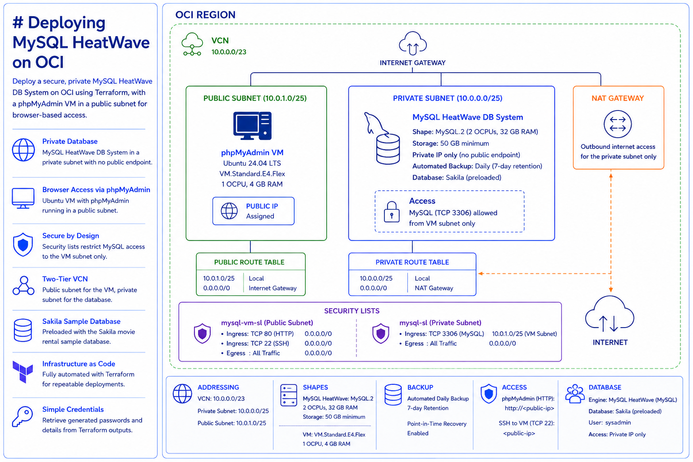
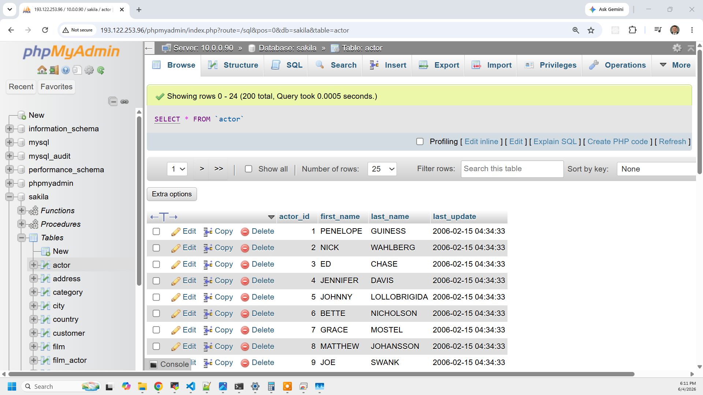

# Deploying MySQL HeatWave on OCI

This project demonstrates how to deploy a secure, private MySQL HeatWave DB System on Oracle Cloud Infrastructure using Terraform.

The deployment provisions a fully managed OCI MySQL HeatWave DB System with no public endpoint, isolated in a private subnet of a custom VCN. To provide convenient browser-based access for database interaction, the project also deploys a lightweight Ubuntu virtual machine running [phpMyAdmin](https://www.phpmyadmin.net/) in a public subnet.

As part of the setup, the [Sakila](https://dev.mysql.com/doc/sakila/en/) sample database—a fictional movie rental database—is loaded into the MySQL instance to demonstrate real-world queries, administration, and access control in a secure, private cloud environment.



## What You'll Learn

- How to deploy a fully private MySQL HeatWave DB System on OCI using Terraform
- How to design a two-tier VCN with public and private subnets, security lists, and separate route tables
- How to provision a VM running `phpMyAdmin` for browser-based database access
- How to wire OCI credentials and passwords through Terraform state without a vault service

## Overview of OCI MySQL HeatWave

**MySQL HeatWave** is Oracle's fully managed MySQL database service on OCI. It is the same MySQL engine customers run on-premises, delivered as a managed service with built-in backup, patching, and high availability options. The HeatWave query accelerator (optional) enables in-memory OLAP queries directly against operational data without ETL.

This project uses MySQL HeatWave in its standard (non-accelerator) configuration, focused on private networking and operational simplicity.

### OCI MySQL HeatWave vs Azure MySQL Flexible Server

| **Aspect**              | **OCI MySQL HeatWave**                                       | **Azure MySQL Flexible Server**                            |
|-------------------------|--------------------------------------------------------------|------------------------------------------------------------|
| **Networking**          | Private subnet in VCN; no public endpoint option            | Delegated subnet + Private DNS Zone required               |
| **DNS**                 | Private IP assigned directly from subnet; no extra DNS zone | Requires Private DNS Zone + VNet link for name resolution  |
| **Shape model**         | Named shapes (MySQL.2, MySQL.Free, etc.)                    | SKU-based (B_Standard_B1ms, etc.)                          |
| **Always Free tier**    | MySQL.Free (1 OCPU / 2 GB, one per tenancy)                 | Not available                                              |
| **Provisioning time**   | 10–20 minutes                                               | 5–10 minutes                                               |
| **HeatWave accelerator**| Optional in-memory OLAP engine — no equivalent              | Not available                                              |
| **Backup**              | Automated backup with configurable retention                | Automated backup with geo-redundancy option                |

## Prerequisites

* [An OCI Account](https://cloud.oracle.com/)
* [Install OCI CLI](https://docs.oracle.com/en-us/iaas/Content/API/SDKDocs/cliinstall.htm)
* [Install Latest Terraform](https://developer.hashicorp.com/terraform/install)
* OCI CLI configured: `~/.oci/config` with a valid DEFAULT profile

If this is your first time working with OCI and Terraform, set `OCI_COMPARTMENT_ID` to the OCID of the compartment you want to deploy into. If unset, the scripts fall back to the tenancy root.

## Download this Repository

```bash
git clone https://github.com/mamonaco1973/oci-mysql.git
cd oci-mysql
```

## Build the Code

Run [check_env](check_env.sh) then run [apply](apply.sh).

```bash
~/oci-mysql$ ./apply.sh
NOTE: Validating that required commands are found in your PATH.
NOTE: oci is found in the current PATH.
NOTE: terraform is found in the current PATH.
NOTE: jq is found in the current PATH.
NOTE: All required commands are available.
NOTE: Checking OCI CLI connection.
NOTE: Successfully connected to OCI.

Initializing the backend...
Initializing provider plugins...
- Reusing previous version of oracle/oci from the dependency lock file
- Using previously-installed oracle/oci v6.x.x

Terraform has been successfully initialized!
```

> **Note:** MySQL HeatWave DB System provisioning typically takes **10–20 minutes**. The `./apply.sh` command will wait for phpMyAdmin to become reachable before printing the final summary.

## Build Results

After applying the Terraform configuration, the following OCI resources will be created:

### VCN & Subnets
- VCN: `mysql-vcn` — `10.0.0.0/23`
- Private subnet: `mysql-subnet` — `10.0.0.0/25` (MySQL DB System, no public IPs)
- Public subnet: `vm-subnet` — `10.0.1.0/25` (phpMyAdmin VM, public IP assigned)

### Gateways & Route Tables
- Internet Gateway — routes public traffic to/from the VM subnet
- NAT Gateway — provides outbound-only internet access for the MySQL subnet
- Route table per subnet wired to the appropriate gateway

### Security Lists
- `mysql-sl` — allows TCP 3306 inbound from the VM subnet only
- `mysql-vm-sl` — allows TCP 80 (HTTP) and TCP 22 (SSH) inbound from anywhere

### MySQL HeatWave DB System
- Shape: `MySQL.2` (2 OCPUs, 32 GB RAM)
- Storage: 50 GB minimum
- Private IP only — no public endpoint exposed
- Automated daily backups, 7-day retention
- Preloaded with the [Sakila sample database](https://dev.mysql.com/doc/sakila/en/)

### phpMyAdmin VM
- Shape: `VM.Standard.E4.Flex` (1 OCPU, 4 GB RAM)
- Ubuntu 24.04 LTS
- Public IP — accessible at `http://<public-ip>`
- Pre-configured to connect to the MySQL DB System private IP over TLS

## Credentials

After a successful apply, retrieve credentials with:

```bash
./get_password.sh
```

Output:
```
MySQL (HeatWave DB System):
  Username : sysadmin
  Password : <generated>
  Host     : 10.0.0.x (private)

phpMyAdmin VM:
  Username : ubuntu
  Password : <generated>
  Public IP: <public-ip>
  URL      : http://<public-ip>
```

## phpMyAdmin Demo

[phpMyAdmin](https://www.phpmyadmin.net/) is a popular web-based MySQL administration tool that allows users to interact with MySQL databases through a browser interface. It supports query execution, database browsing, import/export, and user management.



Query 1:
```sql
SELECT
    f.title AS film_title,
    CONCAT(a.first_name, ' ', a.last_name) AS actor_name
FROM
    sakila.film f
    JOIN sakila.film_actor fa ON f.film_id = fa.film_id
    JOIN sakila.actor a ON fa.actor_id = a.actor_id
ORDER BY
    f.title, actor_name
LIMIT 20;
```

Query 2:

```sql
SELECT
    f.title,
    GROUP_CONCAT(
        CONCAT(a.first_name, ' ', a.last_name)
        ORDER BY a.last_name
        SEPARATOR ', '
    ) AS actor_names
FROM
    sakila.film f
    JOIN sakila.film_actor fa ON f.film_id = fa.film_id
    JOIN sakila.actor a ON fa.actor_id = a.actor_id
GROUP BY
    f.title
ORDER BY
    f.title
LIMIT 10;
```
